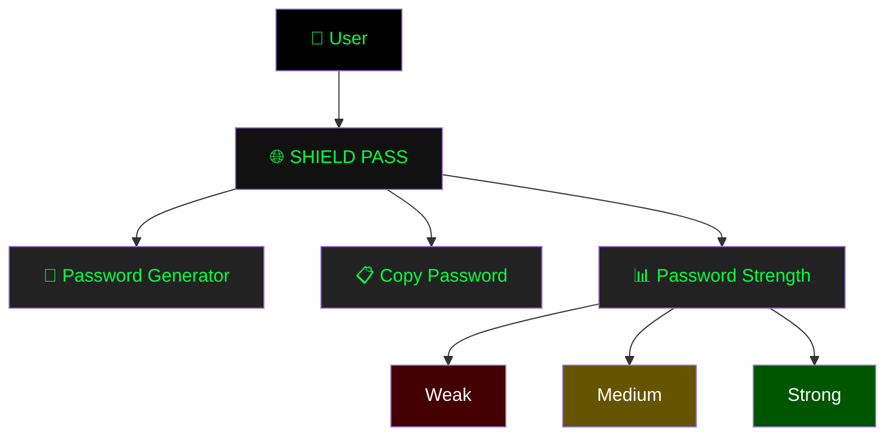
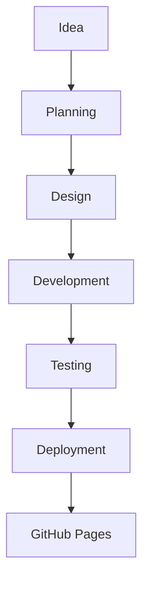
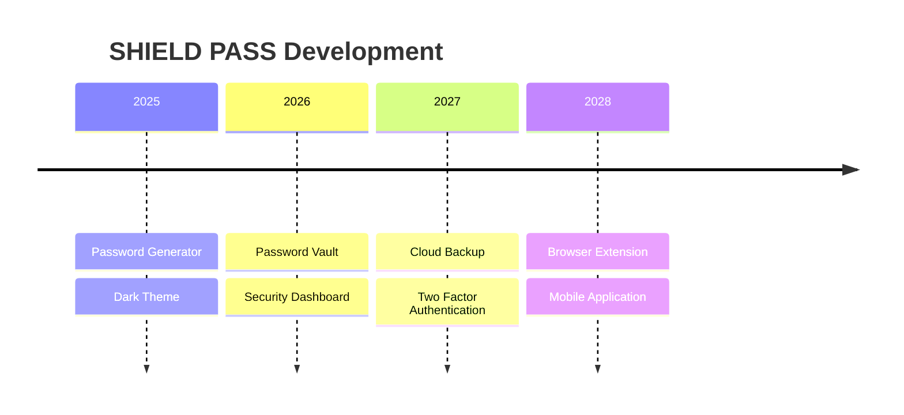

<div align="center">


<br>


<br>

[](https://thaswanth-r.github.io/SHIELD-PASS/)
[](https://github.com/Thaswanth-R/SHIELD-PASS)


</div>

---

# ⚔️ SHIELD PASS

> **SHIELD PASS** is a futuristic cybersecurity-inspired password management application designed with a modern dark interface, smooth animations, and secure password generation. It provides users with a clean and responsive experience while promoting strong password practices.

---

# 🌌 Live Demo

### 🚀 https://thaswanth-r.github.io/SHIELD-PASS/

---

# ✨ Features

- 🔐 Secure Password Generator
- 🛡 Password Strength Indicator
- ⚡ One Click Copy
- 🎨 Cyberpunk UI
- 🌙 Dark Theme
- 📱 Fully Responsive
- 💎 Modern Glassmorphism
- 🚀 Lightning Fast
- 🎯 Easy To Use
- 🔥 Smooth Animations
- 💻 Cross Browser Support
- ⚙ Lightweight Architecture

---

# 🎯 Tech Stack

<div align="center">


</div>

---

# 🏗 Architecture



---

# 🚀 Application Workflow

```mermaid
flowchart LR

Start

-->

Open Website

-->

Generate Password

-->

Analyze Strength

-->

Copy Password

-->

Save Securely

-->

Done
```

---

# 👨‍💻 Development Workflow



---

# 📂 Project Structure

```text
SHIELD-PASS
│
├── assets
│
├── css
│     └── style.css
│
├── js
│     └── script.js
│
├── index.html
│
└── README.md
```

---

# 🎨 UI Highlights

| Feature | Description |
|---------|-------------|
| 🌙 Dark Theme | Futuristic Cyberpunk Interface |
| ⚡ Fast UI | Lightweight Performance |
| 🔥 Animations | Smooth Hover Effects |
| 📱 Responsive | Mobile Friendly |
| 🛡 Security | Strong Password Generation |
| 💎 Modern | Glassmorphism Design |

---

# 📈 Future Roadmap



---

# 🛡 Security Philosophy

Use code with caution.✔ Strong Passwords✔ Secure Design✔ Fast Performance✔ User Friendly✔ Responsive Interface✔ Cyberpunk Experience✔ Clean Code✔ Future Ready
---

# 📊 GitHub Statistics

<div align="center">


</div>

<br>

<div align="center">


</div>

---

# 📉 Activity Graph

<div align="center">


</div>

---

# ⭐ Why SHIELD PASS?

```text
🛡 Military Inspired Interface

🔐 Powerful Password Generator

⚡ Beautiful Animations

💻 Responsive Layout

🚀 Lightweight

🎨 Premium Design

🌙 Dark Hacker Theme

💀 Villain Inspired UI
```

---

# 🤝 Contributing

Contributions are welcome.

```text
Fork Repository

        ↓

Create Branch

        ↓

Commit Changes

        ↓

Push Changes

        ↓

Open Pull Request
```

---

# 📜 License

This project is licensed under the **MIT License**.

---

# 👨‍💻 Developer

<div align="center">

## Developed with ❤️ by Thaswanth-R

<a href="https://github.com/Thaswanth-R">

</a>

</div>

---

<div align="center">


<br>


</div>
